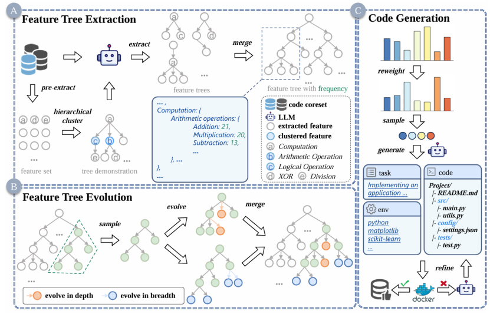

&emsp;&emsp;ICML会议（International Conference on Machine Learning，国际机器学习会议），是全球人工智能和机器学习领域最具影响力的学术会议之一，在CCF学术推荐列表中认定为A类会议。ICML 2025将于2025年7月在加拿大温哥华举行。
<!--more-->

- - - 
- 论文标题：EpiCoder: Encompassing Diversity and Complexity in Code Generation
- 录用类型：ICML2025主会长文
- 论文作者：Yaoxiang Wang+, Haoling Li+, Xin Zhang+, Jie Wu, Xiao Liu, Wenxiang Hu, Zhongxin Guo, Yangyu Huang, Ying Xin, Yujiu Yang\*, Jinsong Su\*, Qi Chen, Scarlett Li 
- 完成单位：厦门大学，清华大学，微软

- 论文简介：
现有的大语言模型在代码生成方面已取得显著进展，但在面对复杂结构、多样语义与跨文件依赖等真实开发场景时仍存在能力瓶颈。为了支持更高质量、结构合理、复杂度可控的代码生成任务，论文提出了一个结构驱动的数据合成框架 EpiCoder，引入“特征树（feature tree）”作为代码语义的中间结构表示，系统性地控制代码片段的结构、语义及跨组件依赖关系。借助这一结构化合成流程，EpiCoder 能够生成可调复杂度、结构清晰且跨语义路径多样化的代码数据，从而有效提升模型在结构化理解与复杂生成任务上的表现。实验证明，EpiCoder 可广泛支持包括模块级代码生成、跨文件建构、语义覆盖增强等任务，并在多个代表性基准任务中显著提升现有代码大模型的性能与泛化能力。