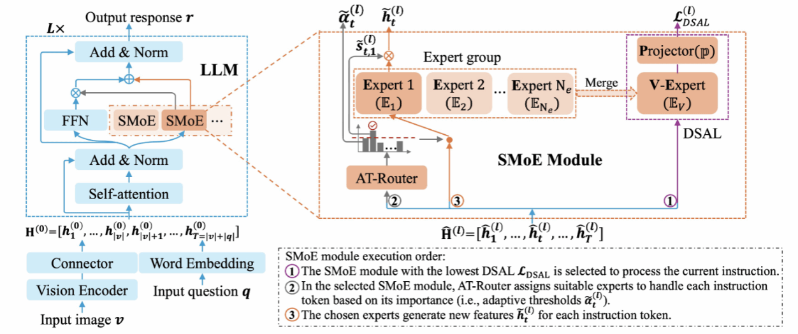
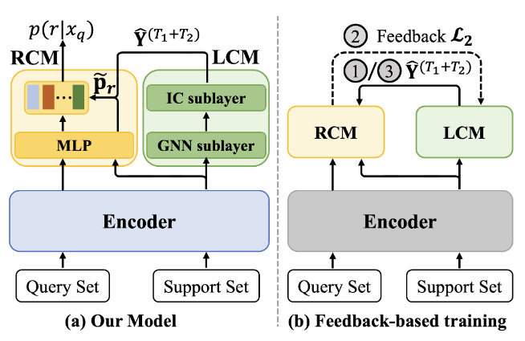
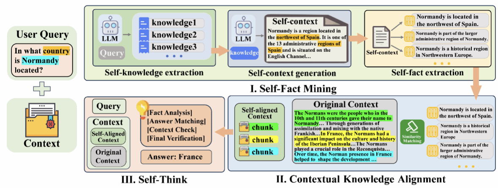
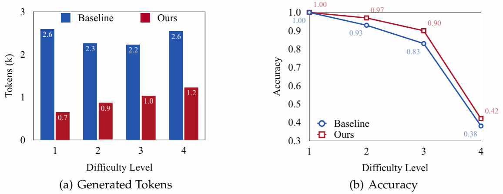
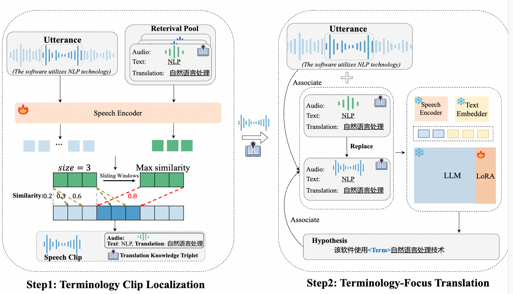
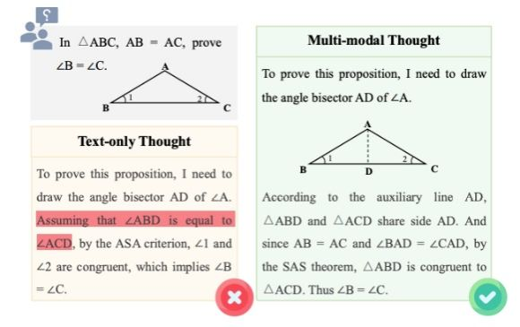
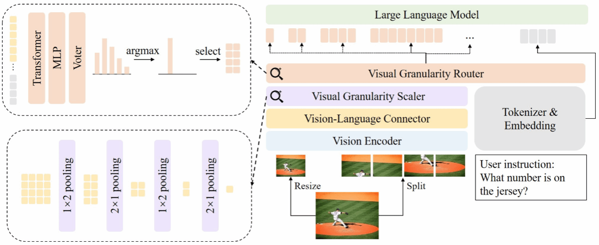

ACL会议全称为Annual Meeting of the Association for Computational Linguistics，由国际计算语言学协会ACL举办，是自然语言处理最重要的学术会议，在CCF学术推荐列表中认定为A类会议。‌ACL 2025将于2025年7月27日至8月1日在奥地利维也纳举行。
<!--more-->

- - - 
- 论文标题：Advancing SMoE for Continuous Domain Adaptation of MLLMs: Adaptive Router and Domain-Specific Loss
- 录用类型：Main, Long paper
- 论文作者：Liang Zhang+, Ziyao Lu+, Fandong Meng, Hui Li, Jie Zhou, and Jinsong Su\*
- 完成单位：厦门大学，微信

- 论文简介：
近期研究已经探索了多模态大模型的连续任务学习。然而，更加现实的多模态大模型连续领域学习还没被探索过。因此，本研究提出了一个基于SMoE的多模态大模型连续领域适应方法。具体而言，该方法为每一个新领域在多模态大模型的每个FFN子层中学习一个单独的SMoE模块。通过这种方法来避免领域之间冲突所带来的灾难性遗忘问题。同时，为了提高模型对每个领域的学习能力，每个SMoE模块配备了一个基于自适应阈值的路由器(AT-Rounter)，其根据每个指令token的重要性来进行专家分配。为了缓解SMoE模块中专家训练不充分的问题，本研究引入了一个领域特定的自回归损失 (DSAL)，其能够让每个专家能够利用每个训练指令进行充分训练。此外，DSAL还能够用于识别实例测试指令是来自哪一个领域，以准确地分配对应SMoE模块来进行处理。最后，本文构建了一个连续领域学习的benchmark，并验证了本研究方法的有效性。
- - -
- 论文标题：A Self-Denoising Model for Robust Few-Shot Relation Extraction
- 录用类型：Main, Long paper
- 论文作者：Liang Zhang, Yang zhang, Ziyao Lu, Fandong Meng, Jie Zhou, and Jinsong Su\*
- 完成单位：厦门大学，微信

- 论文简介：
在低资源关系抽取领域中，现有工作都采样原型网络的范式，并且假设每个few-shot 任务中的支持集仅包含准确标注的支持实例。然而，在现实场景中噪声标签是不可避免的，因此进一步提高关系抽取模型对支持集中噪声标签的鲁棒性是一个关键的研究课题。为此，本研究提出了一个自降噪声的关系抽取模型，其包含了两个关键成分：标签修正模块和关系预测模块。具体来说，对于每个few-shot 任务，本研究首先使用标签修正模块根据支持集中支持实例在嵌入空间中的相对位置来修正它们的噪声标签。然后，关系预测模块根据这些修正标签去准确地预测每个询问实例的关系。此外，本文提出了一个基于反馈的训练策略，其聚焦于训练标签修正模块和关系预测模块去协调地处理支持集中的噪声标签。最后，两个常用数据的实验有效地验证了我们模型的有效性。
- - -
- 论文标题：FaithfulRAG: Fact-Level Conflict Modeling for Context-Faithful Retrieval-Augmented Generation
- 录用类型：Main, Long paper
- 论文作者：Qinggang Zhang+, Zhishang Xiang+, Yilin Xiao, Le Wang, Junhui Li, Xinrun Wang, and Jinsong Su\*
- 完成单位：厦门大学，香港理工大学，咪咕新空，苏州大学，新加坡管理大学

- 论文简介：
检索增强型生成系统在处理知识密集型任务中展现出巨大潜力，然而，当检索到的上下文与大模型的参数化知识发生冲突时，生成结果的不一致性问题成为了一个亟待解决的重大挑战。目前的忠实性提升方法主要通过严格限制模型对上下文的依赖来解决这一问题，但这些方法往往会抑制模型的参数化知识，导致模型内部知识结构受损，增加了对上下文的误读风险。针对这些问题，本研究提出了创新性的FaithfulRAG框架。该框架通过明确对模型参数化知识与检索上下文之间的差异进行建模，精准定位知识冲突，设计了一个自我思考过程，使大模型能够在生成响应之前对冲突事实进行推理和整合。大量的实验结果表明，我们方法不仅能够有效解决知识冲突问题，还显著提高了生成结果的准确性和忠实性，同时保持了模型对上下文的正确解读能力。
- - -
- 论文标题：Don't Get Lost in the Trees: Streamlining LLM Reasoning by Overcoming Tree Search Exploration Pitfalls
- 录用类型：Main, Long paper
- 论文作者：Ante Wang, Linfeng Song\*, Ye Tian, Dian Yu, Haitao Mi, Xiangyu Duan, Zhaopeng Tu\*, Jinsong Su\*, and Dong Yu
- 完成单位：厦门大学，腾讯AI Lab，苏州大学

- 论文简介：
近期研究表明，树搜索算法可显著提升大模型的推理性能，但其高昂的计算成本严重制约了实际应用。通过深入分析，本文发现该研究方向存在“过思考”与“欠思考”的双重问题：（1）搜索树中冗余状态（语义等价状态）的重复探索导致过思考问题；（2）验证器评分的高方差引发搜索路径频繁切换，造成欠思考问题。为此，本研究提出FETCH——一种即插即用的高效树搜索框架，与主流树搜索算法具有良好的兼容性。具体而言，FETCH通过聚类算法合并语义相似状态以缓解过思考问题；同时，采用时序差分学习优化验证器训练，并引入验证器集成策略降低评分方差，有效缓解欠思考问题。在多个数学推理基准测试中的实验结果表明，我们方法可显著提升树搜索算法的推理准确率和计算效率，为大模型的实用化推理提供了高效解决方案。
- - -
- 论文标题：Locate-and-Focus: Enhancing Terminology Translation in Speech Language Models
- 录用类型：Main, Long paper
- 论文作者：Suhang Wu, Jialong Tang, Chengyi Yang, Pei Zhang, Baosong Yang, Junhui Li, Junfeng Yao\*, Min Zhang, and Jinsong Su\*
- 完成单位：厦门大学，通义实验室，苏州大学

- 论文简介：语音翻译领域正受到日益广泛的关注，然而，准确翻译语音中的专业术语仍然是一个亟待解决的重大挑战。目前的研究主要集中于将各类翻译知识整合到语音大模型中，但这些方法往往会受到无关信息的干扰，且未能充分发挥翻译知识的潜力。针对这些问题，本研究提出了创新性的Locate-and-Focus方法。该方法首先精准定位语音中包含专业术语的语音片段，效减少语音翻译模型中的干扰信息。随后，该方法将翻译知识与语音和翻译文本建立关联，使语音大模型在翻译过程中能够更加精准地聚焦于相关的翻译知识。在多个数据集上的实验结果证明了我们方法不仅能够有效定位语音中的专业术语，并显著提高了专业术语的翻译准确率，同时还能够保持通用翻译的质量。
- - -
- 论文标题：Investigating inference-time scaling for chain of multi-modal thought: A preliminary study
- 录用类型：Findings, Long paper
- 论文作者：Yujie Lin+, Ante Wang+, Moye Chen, Jingyao Liu, Hao Liu, Jinsong Su\*, and Xinyan Xiao
- 完成单位：厦门大学，百度

- 论文简介：近期研究已经证明思维链的推理时间扩展是提升多模态推理能力的一种有效方法，然而现有工作大多聚焦于纯文本的思维链。本研究首次针对多模态思维链探讨推理时间扩展带来的影响。在跨不同领域的10个多模态任务上，本研究系统评估了主流的基于采样和基于树搜索的推理时间扩展方法，并提供了全面的分析。此外，本研究统一采用一致性增强的验证器，以确保在推理过程中提供有效的指导。实验结果表明，对比纯文本思维链，多模态思维链展现出更优的推理性能。然而，这种优势也伴随着更高的令牌消耗成本，给实际应用带来一定挑战。
- - -
- 论文标题：AVG-LLaVA: An Efficient Large Multimodal Model with Adaptive Visual Granularity
- 录用类型：Findings, Long paper
- 论文作者：Zhibin Lan, Liqiang Niu, Fandong Meng, Wenbo Li, Jie Zhou, and Jinsong Su\*
- 完成单位：厦门大学，腾讯微信

- 论文简介：当前大型多模态模型在处理高分辨率图像时往往引入大量视觉标记，导致模型推理速度较慢。针对这一问题，本研究提出 AVG-LLaVA，一种能够根据输入图像和指令自适应选择视觉粒度的模型。具体而言，本研究在 LLaVA-NeXT基础上引入视觉粒度缩放器和视觉粒度路由器，分别用于获取不同粒度视觉特征和动态选择视觉粒度。此外，本研究还提出基于多模态大模型反馈的训练范式，使路由器预测的粒度与模型偏好对齐，而无需额外注释数据。实验表明，AVG-LLaVA 在 11 个多模态基准上表现优异，并能显著提高推理速度。特别的，在 AI2D 基准上减少 85.3% 视觉标记，推理速度提升 2.53 倍。
