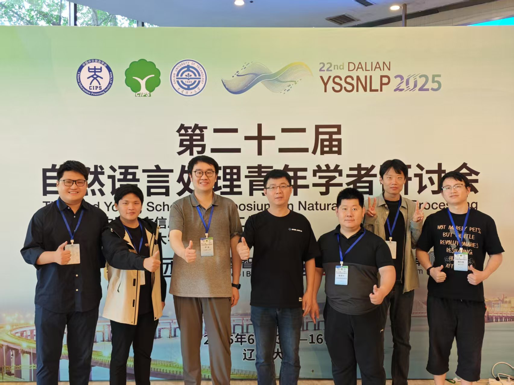
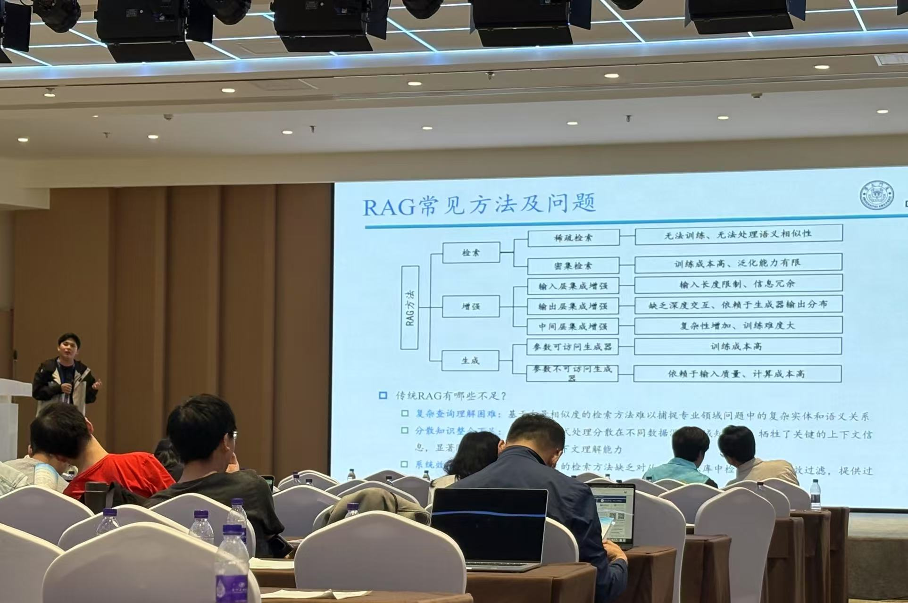

&emsp;&emsp;由大连理工大学承办的自然语言处理青年学者研讨会（YSSNLP 2025）于2025年6月13日至16日在美丽的海滨城市——辽宁省大连市隆重召开。众多NLP领域的知名专家和优秀青年学者汇聚一堂，围绕自然语言处理当前的热点与难点问题展开了深入讨论与交流。课题组苏劲松老师、张庆刚老师、李辉博士后、王安特同学和操佳俊同学参加了此次学术盛会。
<!--more-->

<figure>
  
  <figcaption style="text-align: center;">课题组及与会青年学者合影</figcaption>
</figure>

&emsp;&emsp;本次会议的主题为“大模型拓界语言智能新境，连青年共筑学术创新生态”。会议旨在面向国家战略需求，紧密跟踪国际前沿发展动态，深入探讨青年学者如何把握时代机遇，开展具有特色的创新研究工作，为促进自然语言处理领域国内外青年学者间的交流搭建了宝贵平台。

&emsp;&emsp;会议期间，各项议程顺利进行，与会学者就大模型技术发展、多模态技术、知识增强、信息抽取、智能体等前沿议题分享了真知灼见，交流氛围热烈，充分展现了领域的最新进展与蓬勃活力。课题组助理教授张庆刚受邀在“青年学者思想秀”环节做了题为“基于图结构的大模型知识增强”的精彩报告；博士研究生王安特也在海报展示环节介绍了其研究工作，均成功展示了本课题组在相关方向的最新科研成果，获得了与会同行的积极关注。

<figure>
  
  <figcaption style="text-align: center;">课题组助理教授张庆刚在青年学者思想秀上分享工作</figcaption>
</figure>

&emsp;&emsp;课题组成员会议期间积极参与各项活动，与多位国内顶尖学者及企业前沿专家进行了深入交流与探讨，有效拓展了学术视野，进一步加深了课题组与国内自然语言处理领域专家学者及研究机构的联系与合作。本次参会对于把握研究前沿、促进课题组发展具有重要意义。