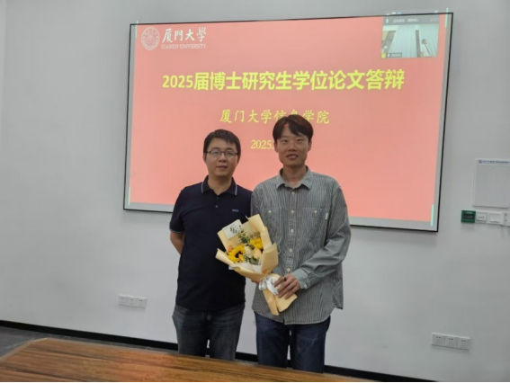
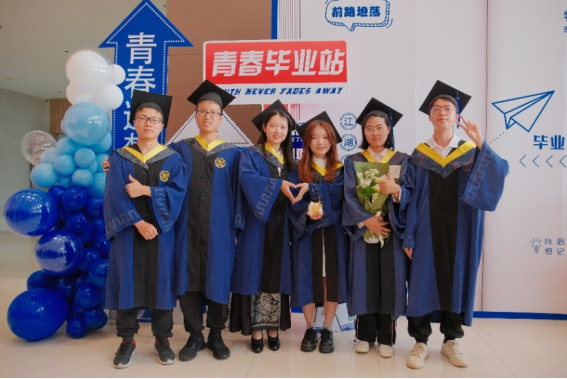

&emsp;&emsp;凤凰花开骊歌起，凌云木成始道别。近日，我课题组2025届1名博士生与6名硕士生圆满完成学位论文答辩，为在厦大校园的求学历程书写下精彩终章。
<!--more-->

<figure>
  
  <figcaption style="text-align: center;">苏劲松老师与博士毕业生王安特同学合影</figcaption>
</figure>
<figure>
  
  <figcaption style="text-align: center;">2025届硕士毕业生于益海嘉里楼合影</figcaption>
</figure>
&emsp;&emsp;本届毕业生学术成果斐然，累计在Artificial Intelligence、ACL、AAAI等人工智能领域权威期刊和会议发表论文十余篇，斩获国家发明专利多项。而今英才辈出，各展宏图：王安特博士将赴清华智能产业研究院开展博士后研究工作；硕士生中，黄健亨赴北大中文系攻读博士学位，蓝志彬获本校转博资格，邵良颖就职阿里国际，宋佳就职小米集团，余嘉炜就职科大讯飞，岳皓加入国家电网。

&emsp;&emsp;此去星辰大海，愿诸君：持科学之炬火，照九洲之万疆；怀赤子之心志，成时代之栋梁！期待在人工智能发展的历史画卷中，继续书写属于你们的辉煌篇章！
